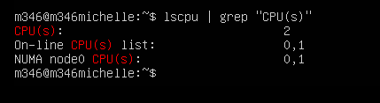
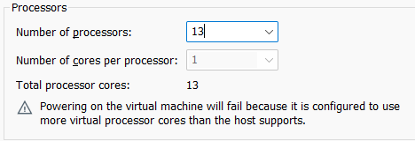
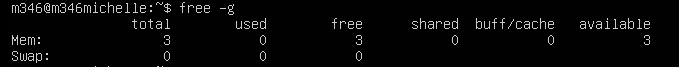

# KN01
- Weniger CPU als Host-System

- Mehr  CPU als Host-System

- Weniger RAM als Host-System

- Mehr  RAM als Host-System

- Erklärung
Wenn wir einer VM mehr Ressourcen (z. B. CPUs oder RAM) zuweisen, als unser physischer Computer tatsächlich hat, könnte die VM eine schlechte Leistung erbringen, oder Sie könnten Fehlermeldungen erhalten, weil das System zu stark belastet wird.
