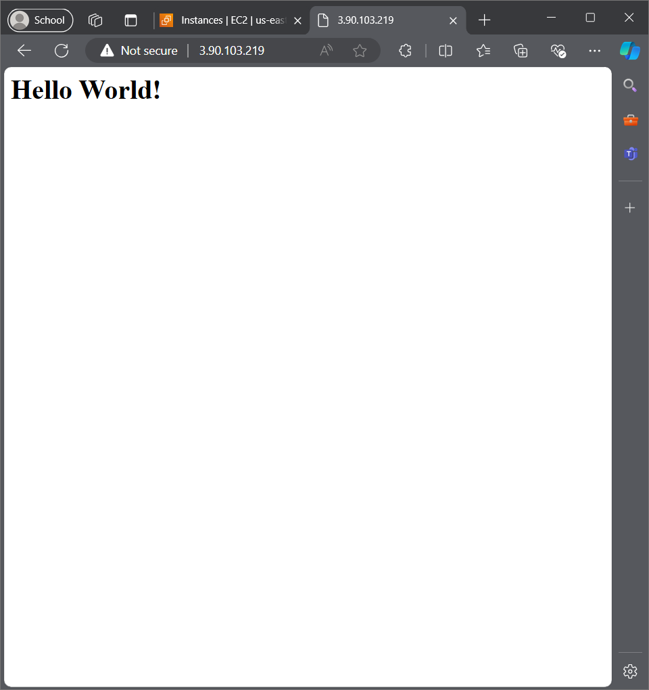
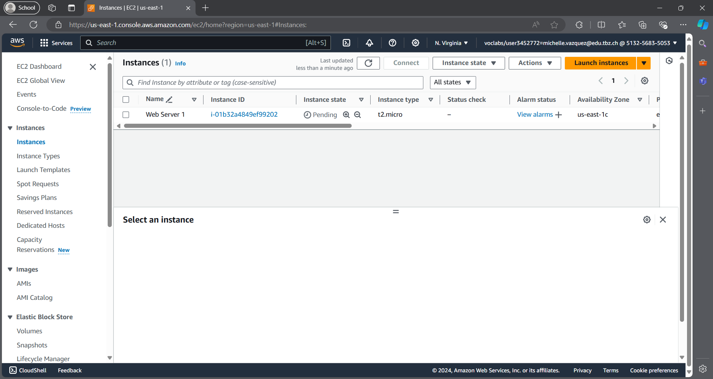
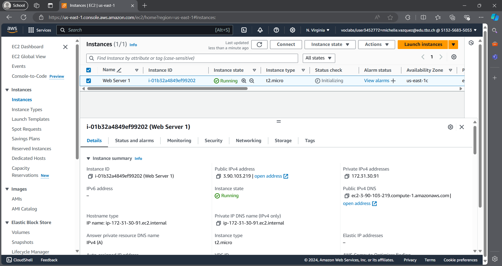
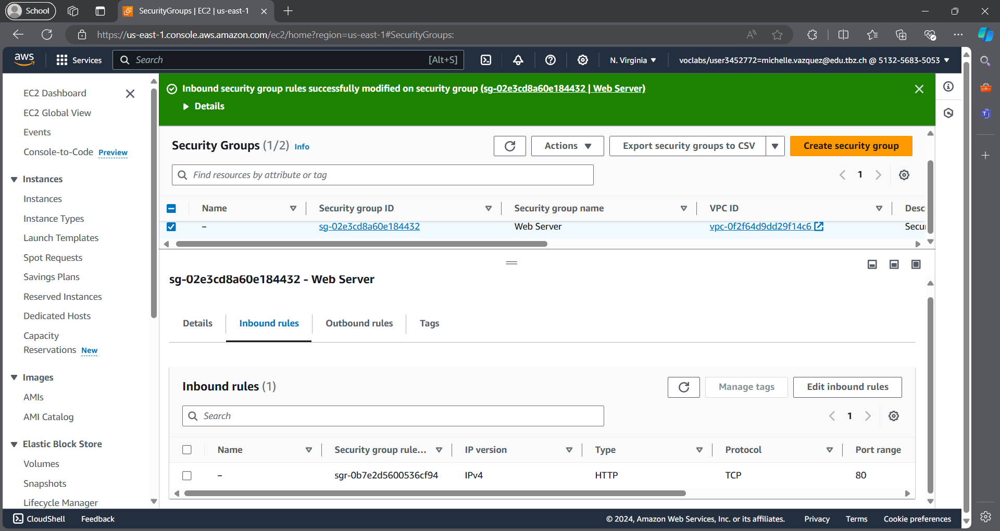
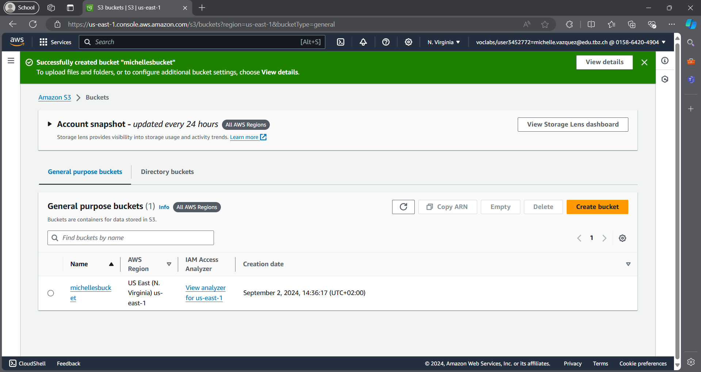
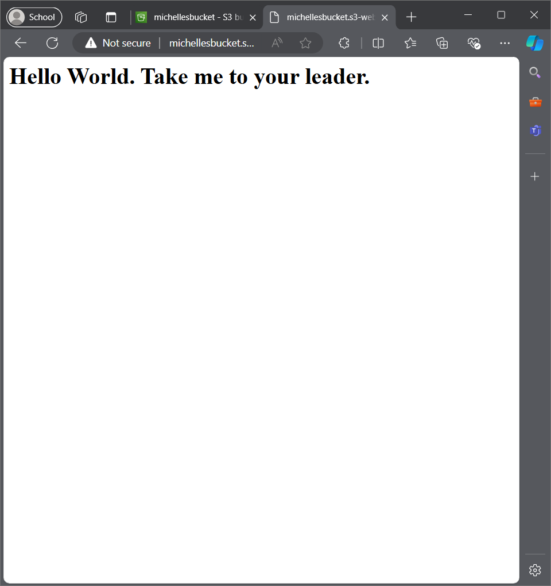
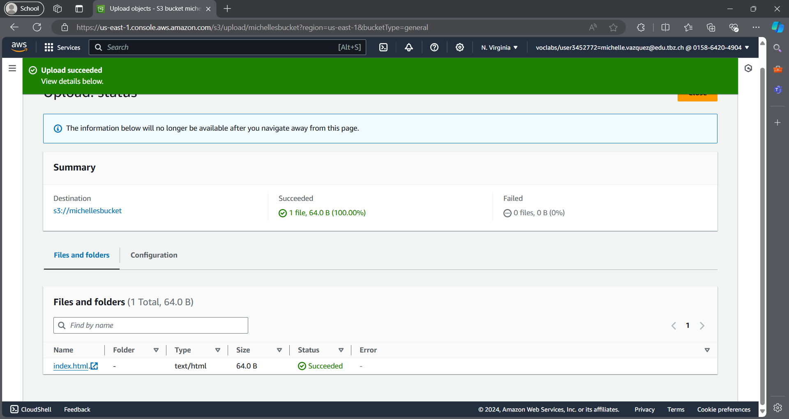
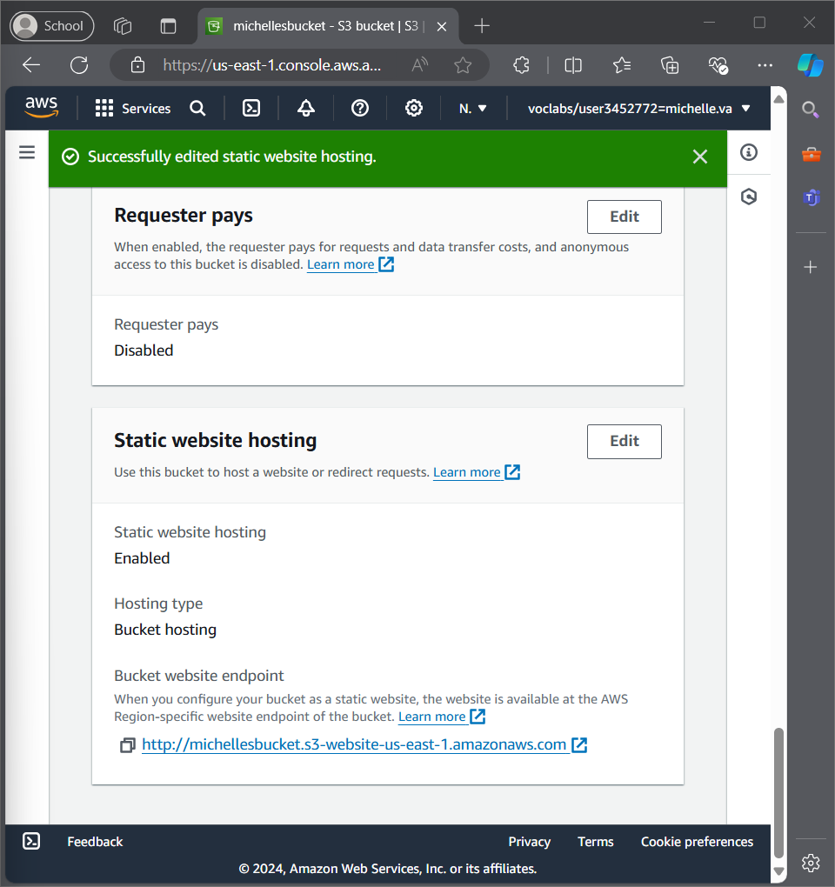

# LAB 4.1- EC2

- Hier ist die HTML-Seite
  
  
- Hier ist die URL benutz die HTML-Seite zu erreichen: 3.90.103.219

- Hier ist eine liste von der EC2-Instanzen:

- Hier ist eine liste von Details der Web Server-Instanz:

- Hier ist eine screenshot von Liste der Inbound-Regeln:

# LAB 4.2- S3

- Hier ist eine liste von der Buckets:

- Hier ist die HTML-Seite
  
  
- Hier ist die URL benutz die HTML-Seite zu erreichen: http://michellesbucket.s3-website-us-east-1.amazonaws.com

- Hier ist eine liste von Datei im Bucket:

- Hier ist eine screenshot von die Eigenschaften von Static website hosting:

