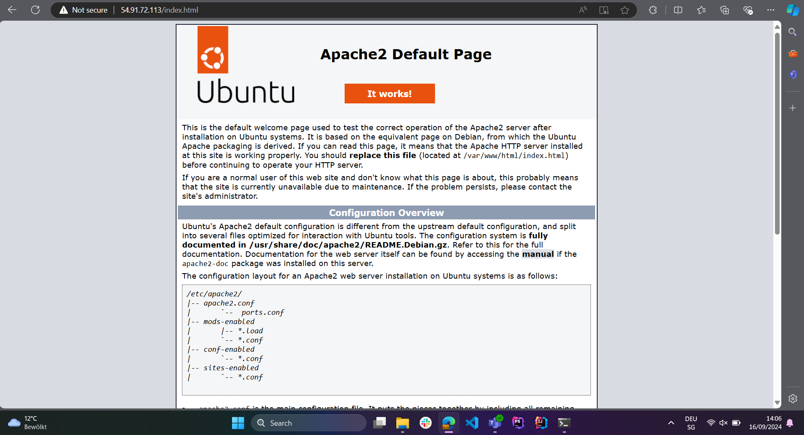
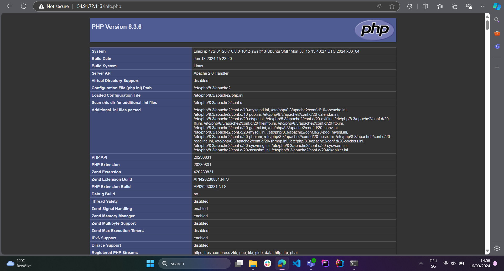
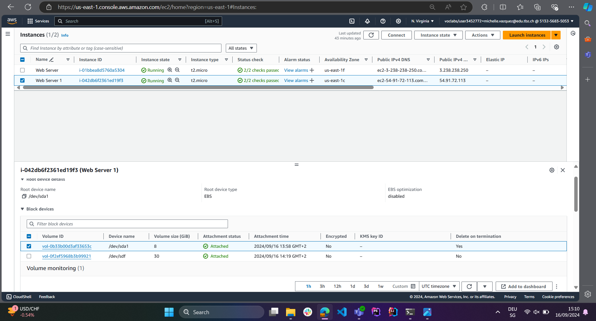

# KN03: IaaS - Virtuelle Server
## Installation von Web- und Datenbankserver
Screenshots der funktionierenden Webseiten:
 - index.html

 - info.php

 - db.php

## Elastic Block Storage (EBS) hinzufügen
Screenshots der Liste der EBS (2 Volumen) der Instanz

- Kurze Erklärung für was eine zusätzliche virtuelle Disk verwendet werden könnte.
  - An additional virtual disk can be used for a variety of purposes like data storage for example, to store application data, files, or logs separate from the system root volume. Backup and Snapshots, for     regular backups of important data. Databases to store database files on a separate disk to improve performance and ease of scaling. Or even log files were we can store system or application logs on the new volume to avoid filling up the root disk and potentially causing system issues.
