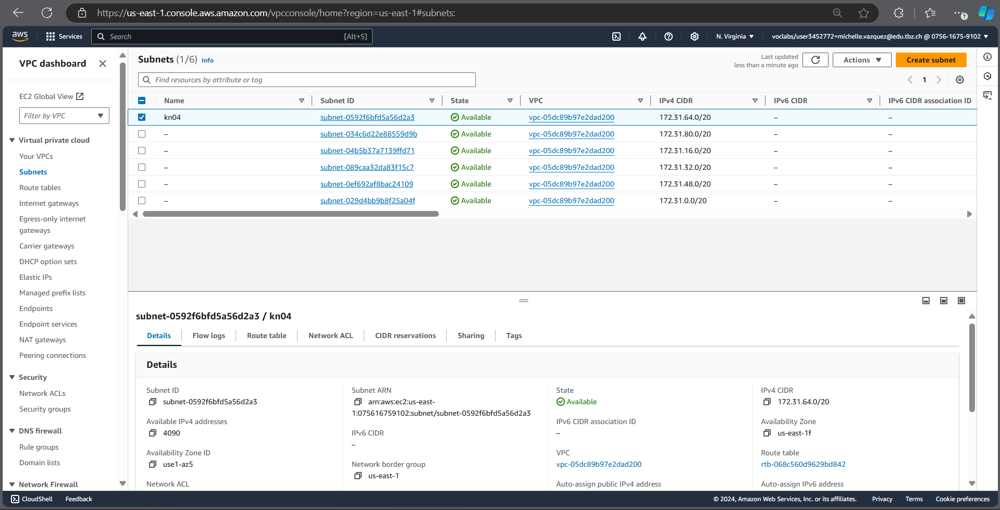

# Network / Security
## Create a chart
- What is a VPC?
  - VPC is the abreviation for Virtual Private Cloud. A Virtual Private Cloud is a private network withing a cloud service like the one we are using AWS. It let us set up our own IP addressranges using CIDR block, create subnets, and manage how traffic flows in and out of our network. It is a secure and flexible environment were we can connect and organize our AWS resourcesin a private section of the cloud. Some examples of resources would be servers, databases and storages.
- What is a subnet?
  - A subnet is a smaller network within the VPC's overall IP address range. It helps divide the VPC into smaller and more manageable chunks. This can be useful for, for example, organizing resources based on their security needs or traffic. We can put resources like EC2 instances into different subnets, since they work withing the same VPC. Subnets can be public, which means they can be accessed from the internet, but they can be private too which means that they're only available within the internal network.
## Select subnet and private IP

- Webserver: 172.31.64.10
- Database: 172.31.64.20
## Create objects and instances
