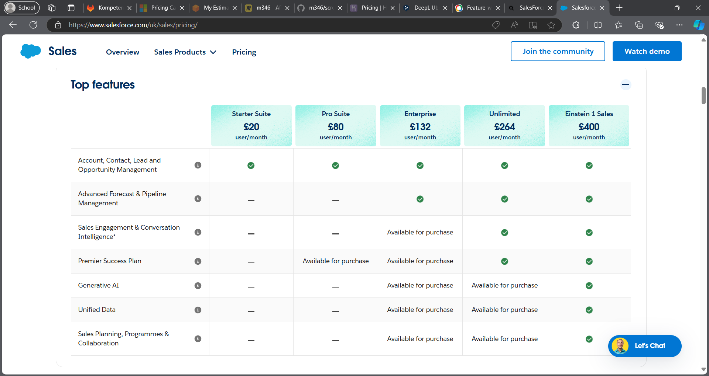

# Create cost calculation
## Rehosting

I chose t3a.small because it offer 1vCPU and 2GB of RAM at a lower cost compared to the standard t3 instances.For the database i chose t3a.medium since it provides with the 2 vCPUs and 4GB RAM, wich is ideal to run database workload that requires moderate compute and memory capacity. THe load balancer is a ALB it's designed for HTTP/HTTPS traffic and is well suited for our web server setup and has 1GB wich was stimated on a minimal web traffic (could be changed on the future). The AWS Simple Storage is a highly durable, scalable and cost-effective storage solution, and it provides inmediat access to the backups when needed.

B1s is known as a burstable instance type in Azure, this offers 1vCPU and 2GB of RAM with the ability to burst CPU when necessary. Here B2s instance offers 2 vCPUs and 4GB RAM wich allows to handle database tasks effitiently keeping cost low.The Azure Load Balancer is basically the same as AWS.

## Replatforming

The plan that i decided fittet the best in this case would be Production, wich is enough for a small company. Next thing i chose to have 2 dyno standard 2x to be able to habe the 2GB of RAM and it's required by the web to actually add two, to continue. I chosed the Standar 2 Postgres because even tho is a plan that is bigger than our requirements it's the one who is closer to our requirements with 8GB RAM and 256GB storage. Added the Apache Kafka since is the cheapest available to our plan with 150GB capacity.
## Repurchasing

In Saleforce cloud i thought that the best fit for this company would be the enterprice offer wich is quite expensive but has a lot of useful features and gives the option to purchase more if needed, thing that the pro suit doesn't have sadly. With this offer being 132$ per user/month having 16 employees means that the company should pay monthly 2112$ wich in CHF is 1’785.70.

In Zoho i think the professional suit best for this company since it has more storage capability that covers the needs that the company has. The monthly payment is 35 euros per user, having 16 workers means that we would pay 560 euros per month and in CHF that would be 527.24.

I would choose IaaS since the customization makes easier to fullfil the requirements more exactly and control the price directly, but at the same time is more complex and difficult for a person that doesn't have the necessary knowledge about the topic. If i would had to consider the accesssibility and time required i'll probably chose SaaS.

# Interpretation of the results
- How much do the offers differ?
  - The offers differ a lot being the rehosting cheaper and the replatforming significantly more expensive. The repurchasing can vary a lot.
- Which is the cheapest?
  - Rehosting is the cheapest without doubt.
- Why is one of them much more expensive? But is it really more expensive?
  - It's more expensive since we need to select from a small range of options, paying for more that we are looking for. We do in fact pay more but we have features that on the other offers we may not have.
